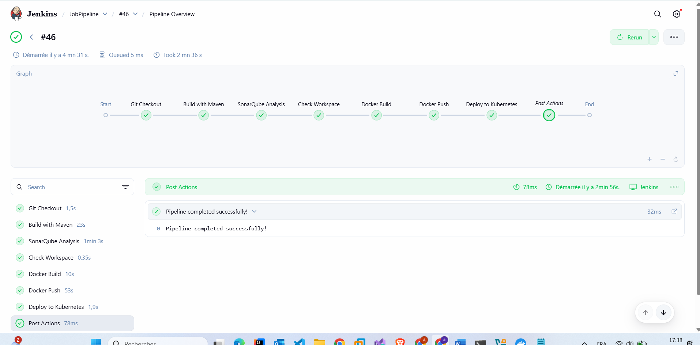
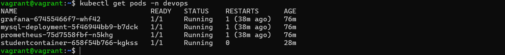
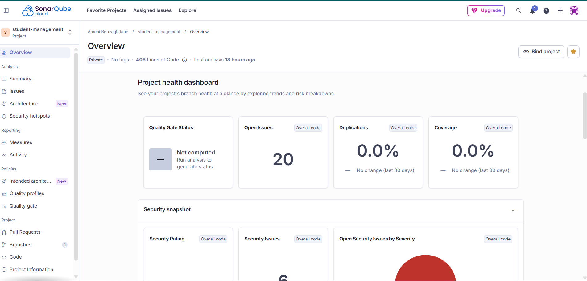
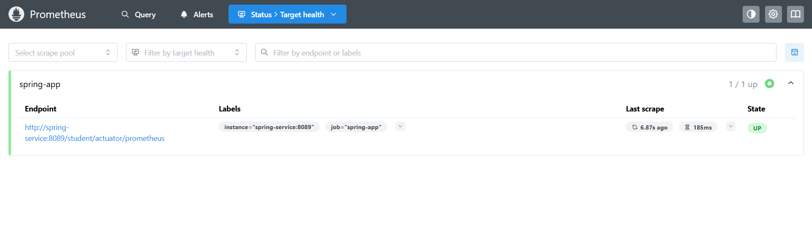
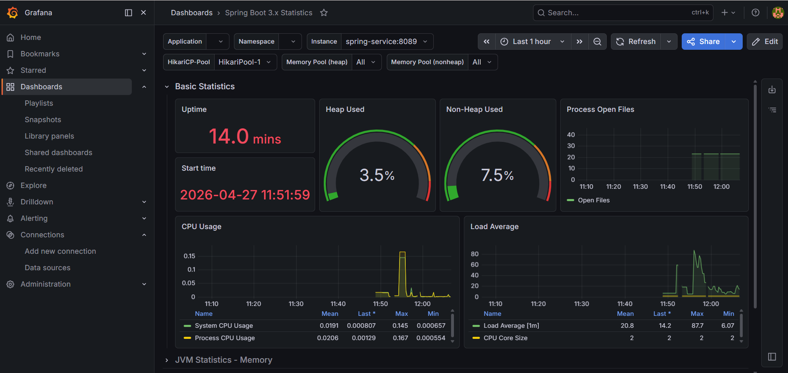

# 🚀 DevOps Pipeline — Student Management System

> A production-inspired DevOps project demonstrating a full CI/CD pipeline with containerization, Kubernetes orchestration, and real-time monitoring — built from scratch on a local Vagrant VM.

---

## 📸 Architecture Overview

```
 ┌─────────────────────────────────────────────────────────────────┐
 │                     Vagrant VM · Ubuntu 22.04                   │
 │                                                                 │
 │  ┌─────────────┐   push    ┌─────────────┐                      │
 │  │   Jenkins   │──────────▶│  Docker Hub │                      │
 │  │  CI/CD      │           │    Image    │                      │
 │  │  :8181      │           └──────┬──────┘                      │
 │  └──────┬──────┘                  │ pull                        │
 │         │ sonar                   ▼                             │
 │         │          ┌──────────────────────────────┐            │
 │  ┌──────▼──────┐   │       Minikube Cluster        │            │
 │  │ SonarCloud  │   │                               │            │
 │  │  (remote)   │   │  ┌─────────────┐              │            │
 │  └─────────────┘   │  │ Spring Boot │              │            │
 │                    │  │   :8089     │              │            │
 │                    │  └──────┬──────┘              │            │
 │                    │         │                     │            │
 │                    │  ┌──────▼──────┐              │            │
 │                    │  │  MySQL 8    │              │            │
 │                    │  │  testdb     │              │            │
 │                    │  └─────────────┘              │            │
 │                    │                               │            │
 │                    │  ┌─────────────┐              │            │
 │                    │  │ Prometheus  │◀─── scrape ──┤            │
 │                    │  │  :30090     │              │            │
 │                    │  └──────┬──────┘              │            │
 │                    │         │ datasource          │            │
 │                    │  ┌──────▼──────┐              │            │
 │                    │  │   Grafana   │              │            │
 │                    │  │  :30030     │              │            │
 │                    │  └─────────────┘              │            │
 │                    └──────────────────────────────┘            │
 └─────────────────────────────────────────────────────────────────┘
```

---

## 🛠️ Tech Stack

| Layer | Technology |
|-------|-----------|
| **Application** | Spring Boot 3.x, Java 17, Hibernate JPA |
| **Database** | MySQL 8 |
| **Containerization** | Docker, Docker Hub |
| **Orchestration** | Kubernetes (Minikube) |
| **CI/CD** | Jenkins |
| **Code Quality** | SonarCloud |
| **Monitoring** | Prometheus, Grafana |
| **Infrastructure** | Vagrant, VirtualBox, Ubuntu 22.04 |
| **Build Tool** | Maven |
| **API Docs** | Swagger / SpringDoc OpenAPI |

---

## 📋 Prerequisites

Install these on your **host machine** before starting:

| Tool | Purpose | Download |
|------|---------|----------|
| VirtualBox 6.x+ | Virtualization provider | [virtualbox.org](https://www.virtualbox.org/wiki/Downloads) |
| Vagrant 2.x+ | VM lifecycle management | [vagrantup.com](https://developer.hashicorp.com/vagrant/downloads) |
| Git | Clone the repository | [git-scm.com](https://git-scm.com/downloads) |

> ✅ Everything else — Docker, Minikube, kubectl, Jenkins, Java 17, Maven — is provisioned **automatically inside the Vagrant VM**. Nothing extra needed on your host.

---

## 📂 Project Structure

```
DevOpsProject/
├── Vagrantfile                       # VM configuration
├── backend/                          # Spring Boot application
│   ├── src/
│   │   └── main/
│   │       ├── java/tn/esprit/       # Controllers, services, entities, repositories
│   │       └── resources/
│   │           └── application.properties
│   ├── Dockerfile                    # Container image definition
│   ├── Jenkinsfile                   # CI/CD pipeline stages
│   └── pom.xml                       # Maven dependencies
├── k8s/                              # Kubernetes manifests
│   ├── mysql-deployment.yaml
│   ├── spring-deployment.yaml
│   ├── prometheus-config.yaml
│   ├── prometheus-deployment.yaml
│   └── grafana-deployment.yaml
└── docs/                             # Screenshots
```

---

## ⚙️ Configuration Files

### Vagrantfile

The VM is configured with 8GB RAM and 2 CPUs, with port forwarding for all services:

```ruby
Vagrant.configure("2") do |config|
  config.vm.box = "bento/ubuntu-22.04"
  config.vm.box_download_options = {"ssl-no-revoke" => true}

  # Uncomment and set your own IP if you need a private network
  # config.vm.network "private_network", ip: "YOUR_HOST_IP"

  # Port forwarding — host:guest
  config.vm.network "forwarded_port", guest: 8080, host: 8181   # Jenkins
  config.vm.network "forwarded_port", guest: 9090, host: 9091   # Prometheus internal
  config.vm.network "forwarded_port", guest: 3000, host: 3001   # Grafana internal
  config.vm.network "forwarded_port", guest: 30090, host: 30090 # Prometheus NodePort
  config.vm.network "forwarded_port", guest: 30030, host: 30030 # Grafana NodePort

  config.vm.provider "virtualbox" do |vb|
    vb.memory = "8000"
    vb.cpus = "2"
  end
end
```

---

### Dockerfile

The Spring Boot app is packaged into a Docker image.

> ✅ **You don't need to build the image yourself** — it is already published on Docker Hub and will be pulled automatically by Kubernetes.
>
> 🔗 [ameni221/springboot-app on Docker Hub](https://hub.docker.com/r/ameni221/springboot-app)
>
> 👤 [Docker Hub Profile](https://hub.docker.com/u/ameni221)

If you want to build your own image instead:

```dockerfile
FROM ameni221/mon-springboot:latest

# Install Java 17
RUN apk update && apk add openjdk17

WORKDIR /app
COPY target/*.jar app.jar
EXPOSE 8080
ENTRYPOINT ["java", "-jar", "app.jar"]
```

```bash
# Build and push your own image
cd backend
mvn clean package -DskipTests
docker build -t YOUR_DOCKERHUB_USERNAME/springboot-app:latest .
docker push YOUR_DOCKERHUB_USERNAME/springboot-app:latest

# Then update the image name in k8s/spring-deployment.yaml
```

---

### Jenkinsfile

The pipeline is defined in `backend/Jenkinsfile` and runs automatically on every push:

```groovy
pipeline {
    agent any
    environment {
        DOCKER_IMAGE = "ameni221/springboot-app:latest"
        KUBE_NAMESPACE = "devops"
    }
    stages {
        stage('Git Checkout') {
            steps {
                git(
                    url: 'https://github.com/Ameny323/DevOpsProject.git',
                    branch: 'main',
                    credentialsId: 'github-credentials'
                )
            }
        }
        stage('Build with Maven') {
            steps {
                dir('backend') {
                    sh 'mvn clean install -DskipTests'
                }
            }
        }
        stage('SonarQube Analysis') {
            steps {
                dir('backend') {
                    withCredentials([string(credentialsId: 'jenkins-sonar', variable: 'SONAR_TOKEN')]) {
                        sh '''
                            mvn sonar:sonar \
                            -Dsonar.login=$SONAR_TOKEN \
                            -Dsonar.host.url=https://sonarcloud.io \
                            -Dsonar.organization=ameny323 \
                            -Dsonar.projectKey=ameny323_DevOpsProject
                        '''
                    }
                }
            }
        }
        stage('Check Workspace') {
            steps {
                sh '''
                    echo "Current directory:"
                    pwd
                    echo "Files in workspace:"
                    ls -la
                '''
            }
        }
        stage('Docker Build') {
            steps {
                dir('backend') {
                    sh 'docker build -t ameni221/springboot-app:latest .'
                }
            }
        }
        stage('Docker Push') {
            steps {
                withCredentials([usernamePassword(
                    credentialsId: 'docker-hub-credentials',
                    usernameVariable: 'DOCKER_USER',
                    passwordVariable: 'DOCKER_PASS'
                )]) {
                    sh '''
                        echo $DOCKER_PASS | docker login -u $DOCKER_USER --password-stdin
                        docker push ameni221/springboot-app:latest
                    '''
                }
            }
        }
        stage('Deploy to Kubernetes') {
            steps {
                sh '''
                    kubectl apply -f k8s/mysql-deployment.yaml -n devops
                    kubectl apply -f k8s/spring-deployment.yaml -n devops
                '''
            }
        }
    }
    post {
        success {
            echo 'Pipeline completed successfully!'
        }
        failure {
            echo 'Pipeline failed!'
        }
    }
}
```



---

## 🔑 Jenkins Credentials Setup

Before running the pipeline, configure these 3 credentials in **Jenkins → Manage Jenkins → Credentials → Global → Add Credentials**:

---

### 1. `github-credentials` — GitHub Personal Access Token

Used by Jenkins to clone the private repository.

**How to generate:**
1. Go to GitHub → **Settings** → **Developer settings** → **Personal access tokens** → **Tokens (classic)**
2. Click **Generate new token (classic)**
3. Give it a name (e.g. `jenkins-access`)
4. Select scopes: ✅ `repo` (full control of private repositories)
5. Click **Generate token** — copy it immediately

**In Jenkins:**
- Kind: `Username with password`
- Username: your GitHub username
- Password: the token you just generated
- ID: `github-credentials`

---

### 2. `jenkins-sonar` — SonarCloud Token

Used by Jenkins to send code analysis results to SonarCloud.

**How to generate:**
1. Go to [sonarcloud.io](https://sonarcloud.io) → log in with GitHub
2. Click your avatar (top right) → **My Account** → **Security**
3. Under **Generate Tokens**, enter a name (e.g. `jenkins-token`) → **Generate**
4. Copy the token immediately

**In Jenkins:**
- Kind: `Secret text`
- Secret: the SonarCloud token
- ID: `jenkins-sonar`

---

### 3. `docker-hub-credentials` — Docker Hub

Used by Jenkins to push the built image to Docker Hub.

**How to generate:**
1. Go to [hub.docker.com](https://hub.docker.com) → log in
2. Click your avatar → **Account Settings** → **Security**
3. Click **New Access Token** → give it a name → **Generate**
4. Copy the token

**In Jenkins:**
- Kind: `Username with password`
- Username: your Docker Hub username
- Password: the access token
- ID: `docker-hub-credentials`

---

## ⚡ How to Run the Project

### 1 — Clone & Boot the VM

```bash
git clone https://github.com/Ameny323/DevOpsProject.git
cd DevOpsProject

vagrant up        # First boot takes ~5–10 minutes
vagrant ssh       # Connect into the VM
```

You'll know it's ready when your prompt changes to `vagrant@vagrant:~$`.

### 2 — Start Minikube

```bash
minikube start --driver=docker
```

Wait until you see:
```
✅  Done! kubectl is now configured to use "minikube" cluster
```

### 3 — Create Kubernetes Namespace & Secret

```bash
kubectl create namespace devops

kubectl create secret generic mysql-secret \
  --from-literal=mysql-root-password=root \
  -n devops
```

### 4 — Deploy All Services

```bash
cd ~/DevOpsProject/k8s

kubectl apply -f mysql-deployment.yaml
kubectl apply -f prometheus-config.yaml
kubectl apply -f prometheus-deployment.yaml
kubectl apply -f grafana-deployment.yaml

# Wait for MySQL to be fully ready before deploying Spring Boot
kubectl wait --for=condition=ready pod -l app=mysql -n devops --timeout=120s

kubectl apply -f spring-deployment.yaml
```

### 5 — Verify All Pods Are Running

```bash
kubectl get pods -n devops
```



### 6 — Configure Jenkins Access to Kubernetes

```bash
sudo cp /home/vagrant/.kube/config /var/lib/jenkins/.kube/config
sudo chown -R jenkins:jenkins /var/lib/jenkins/.kube
```

This allows Jenkins to run `kubectl` commands during the Deploy stage.

### 7 — Open SSH Tunnel for Monitoring UIs

Open a **new terminal on your host machine** and run:

```bash
vagrant ssh -- -L 30090:192.168.49.2:30090 -L 30030:192.168.49.2:30030
```

Keep this window open whenever you want to access Prometheus or Grafana.

---

## 🌐 Service Access

| Service | URL | Credentials |
|---------|-----|-------------|
| Jenkins | http://localhost:8181 | Configured on first boot |
| Spring Boot API | http://192.168.49.2:32639/student | — |
| Swagger UI | http://192.168.49.2:32639/student/swagger-ui.html | — |
| Prometheus | http://localhost:30090 | — |
| Grafana | http://localhost:30030 | admin / admin123 |

To confirm your Minikube IP:
```bash
minikube ip   # usually 192.168.49.2
```

---

## 🔍 SonarCloud Code Quality

| Setting | Value |
|---------|-------|
| Organization | `ameny323` |
| Project Key | `ameny323_DevOpsProject` |
| URL | https://sonarcloud.io/project/overview?id=ameny323_DevOpsProject |

SonarCloud analyzes the codebase on every pipeline run and reports on bugs, vulnerabilities, code smells, and duplications.



---

## ☸️ Kubernetes Deployment

All resources run inside the `devops` namespace on Minikube.

| Deployment | Image | Service Type | Port |
|------------|-------|-------------|------|
| `mysql-deployment` | `mysql:8` | ClusterIP | 3306 |
| `studentcontainer` | `ameni221/springboot-app:latest` | NodePort | 32639 |
| `prometheus` | `prom/prometheus:latest` | NodePort | 30090 |
| `grafana` | `grafana/grafana:latest` | NodePort | 30030 |

### Useful Commands

```bash
# View all resources in the namespace
kubectl get all -n devops

# Stream Spring Boot logs
kubectl logs -n devops deployment/studentcontainer -f

# Restart Spring Boot after a new image push
kubectl rollout restart deployment/studentcontainer -n devops

# Describe a pod for debugging
kubectl describe pod -n devops -l app=studentcontainer
```

---

## 📊 Monitoring — Prometheus & Grafana

### How Metrics Flow

```
Spring Boot Actuator (/student/actuator/prometheus)
           ↓  scraped every 15s
       Prometheus
           ↓  PromQL queries
        Grafana Dashboard
```

### Prometheus — Target Health



### Setting Up Grafana

> ⚠️ Grafana has no persistent storage — repeat these steps after pod restarts.

1. Open http://localhost:30030 → login: `admin` / `admin123`
2. **Connections** → **Data sources** → **Add data source** → **Prometheus**
3. URL: `http://prometheus-service:9090` → **Save & test**
4. **Dashboards** → **New** → **Import** → ID: `19004` → **Load**
5. Select your Prometheus datasource → **Import**

### Grafana Live Dashboard



---

## 🌐 REST API Reference

**Base URL:** `http://192.168.49.2:32639/student`

| Method | Endpoint | Description |
|--------|----------|-------------|
| `GET` | `/students/getAllStudents` | List all students |
| `GET` | `/students/getStudent/{id}` | Get one student by ID |
| `POST` | `/students/createStudent` | Create a new student |
| `PUT` | `/students/updateStudent` | Update an existing student |
| `DELETE` | `/students/deleteStudent/{id}` | Delete a student by ID |

### Example — Create a Student

```bash
curl -X POST http://192.168.49.2:32639/student/students/createStudent \
  -H "Content-Type: application/json" \
  -d '{
    "firstName": "Ameni",
    "lastName": "Ben Ali",
    "email": "ameni@esprit.tn",
    "phone": "+216 12 345 678",
    "address": "Tunis, Tunisia",
    "dateOfBirth": "2000-01-15"
  }'
```

📖 Full interactive docs: `http://192.168.49.2:32639/student/swagger-ui.html`

---

## 🔄 Resuming After a Machine Restart

```bash
# 1 — Start the VM
cd D:\Vagrant\ubunto\DevOpsProject
vagrant up
vagrant ssh

# 2 — Start Minikube
minikube start --driver=docker

# 3 — Restore Jenkins kubeconfig access
sudo cp /home/vagrant/.kube/config /var/lib/jenkins/.kube/config
sudo chown -R jenkins:jenkins /var/lib/jenkins/.kube

# 4 — Verify all pods are running
kubectl get pods -n devops

# 5 — Open monitoring tunnel (new terminal on host)
vagrant ssh -- -L 30090:192.168.49.2:30090 -L 30030:192.168.49.2:30030
```

---

## 🐛 Troubleshooting

| Symptom | Cause | Fix |
|---------|-------|-----|
| `vagrant ssh` fails after `vagrant up` | VM still unpausing | Wait 30s and retry, or power off from VirtualBox GUI then `vagrant up` |
| Minikube stuck on "Pulling base image" | Slow internet on first boot | Wait up to 10 min — subsequent starts are instant |
| Prometheus target DOWN with 404 | Old Docker image without actuator | Rebuild: `mvn package` → `docker build` → `kubectl rollout restart` |
| Grafana panels show N/A | Datasource lost after pod restart | Re-add Prometheus datasource in Connections → Data sources |
| `kubectl` credential error on Windows | Wrong context | Always run `kubectl` inside Vagrant SSH, not Windows CMD |
| `studentcontainer` in CrashLoopBackOff | MySQL not ready yet | Wait 60s, check `kubectl logs -n devops deployment/studentcontainer` |
| Jenkins deploy stage fails | Missing kubeconfig | Run the Step 6 kubeconfig commands above |
| Pipeline SonarQube stage fails | Wrong token or project key | Check `jenkins-sonar` credential and sonar properties in Jenkinsfile |

---

## 👩‍💻 Author

**Ameni Benzaghdane** · [GitHub @Ameny323](https://github.com/Ameny323)

---

## 📄 License

This project was built for educational purposes as part of a DevOps engineering curriculum.
